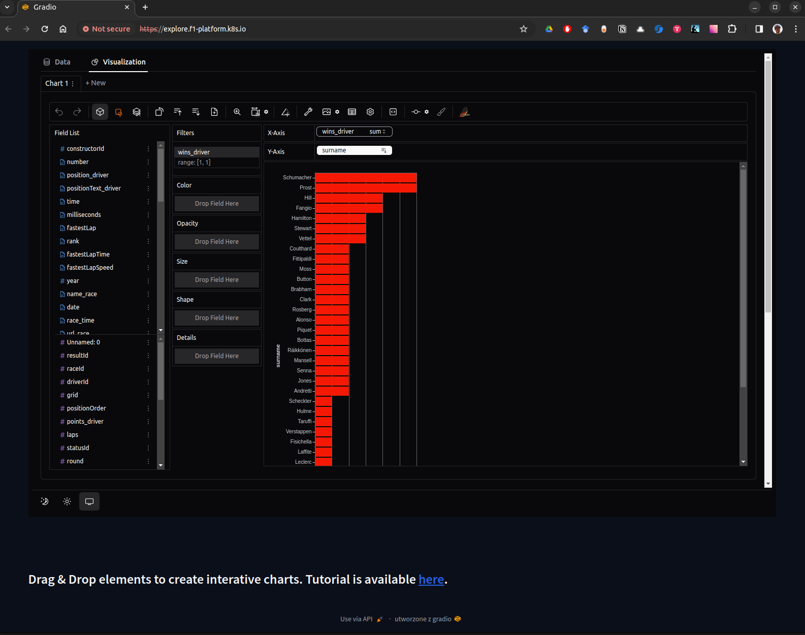

# pygwalker-helm
Repository holding code for deploying a pygwalker-based dashboard enabling doing Exploratory Data Analysis interactively in browser.

# Docker image
## Building
`docker build --no-cache -t f1-data-exploration:v0.1 -f Dockerfile .`

## Running
`docker run -it f1-data-exploration:v0.1`

# Adding image to use in minikube
`minikube image load f1-data-exploration:v0.1`

# Tutorial
[Create Data Visualizations with Graphic Walker](https://docs.kanaries.net/graphic-walker/data-viz/create-data-viz)

# Example
## Homepage

